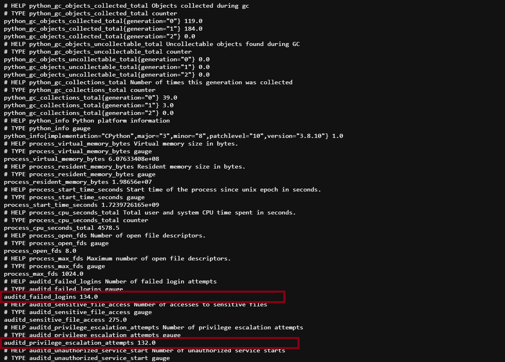
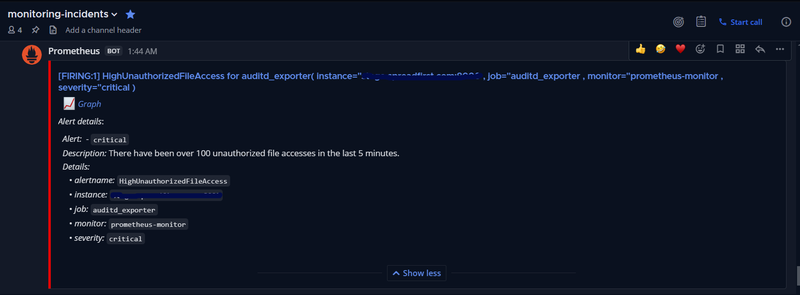

# Audit Exporter
A lightweight exporter that reads the auditd.log file, parses it, extracts specific keywords, and counts their occurrences to export metrics to Prometheus.

## Configure Audit
```bash
sudo apt-get install auditd
```

### Add audit [rules](https://github.com/Neo23x0/auditd/blob/master/audit.rules)
```bash
sudo mkdir /etc/audit/rules.d
sudo vim /etc/audit/rules.d/99-security.rules
sudo systemctl restart auditd
```
### Audit Rule Example
Update `sudo vim /etc/audit/audit.rules`
```bash
-w /etc/ssh/sshd_config -p wa -k unauthorized_file_access
-w /etc/gshadow -p rw -k unauthorized_file_access
```
For more rules click [here](https://github.com/Neo23x0/auditd/blob/master/audit.rules)
## Setup The Exporter Audit
sudo vim /etc/systemd/system/auditd_exporter.service

```bash
[Unit]
Description=Auditd Logins Exporter
After=network.target

[Service]
User=omda
Group=python-exporter
WorkingDirectory=/etc/python-exporter
ExecStart=/usr/bin/python3 /etc/python-exporter/auditd_exporter.py
RestartSec=5s
Restart=always

[Install]
WantedBy=multi-user.target
```

### Enable A service
```bash
sudo system daemon-reload
sudo system enable –now auditd_exporter.service
```

### Python shell
- Install a package `pip3 install prometheus_client `
```python
#!/usr/bin/python3
from prometheus_client import start_http_server, Gauge
import time
import subprocess

failed_logins = Gauge('auditd_failed_logins', 'Number of failed login attempts')
privilege_escalation_attempts = Gauge('auditd_privilege_escalation_attempts', 'Number of privilege escalation attempts')
unauthorized_file_access = Gauge('auditd_unauthorized_file_access', 'Number of unauthorized file accesses')

def parse_audit_log(event_type):
    command = f"grep '{event_type}' /var/log/audit/audit.log | wc -l"
    result = subprocess.run(command, shell=True, capture_output=True, text=True)
    print(f"Grep command output for {event_type}:", result.stdout)
    return int(result.stdout.strip())


def collect_metrics():
    failed_logins.set(parse_audit_log('login_failed'))
    privilege_escalation_attempts.set(parse_audit_log('privilege_escalation'))
    unauthorized_file_access.set(parse_audit_log('unauthorized_file_access'))

if __name__ == '__main__':
    # Start Prometheus metrics HTTP server on port 8000
    start_http_server(8000)  
    while True:
        # Collect metrics every 10 seconds
        collect_metrics()     
        time.sleep(10)
```

## Security Alerts Format To use with Prometheus
You need to update file `alert.rule` on Prometheus configurations
```bash
- name: auditd_alerts or security alert
  rules:
  - alert: HighFailedLogins
    expr: auditd_failed_logins > 100
    for: 5m
    labels:
      severity: critical
      instance: '{{ $labels.instance }}'
    annotations:
      summary: "High number of failed login attempts"
      description: "There have been more than 100 failed login attempts in the last 5 minutes."

  - alert: HighUnauthorizedFileAccess
    expr: auditd_unauthorized_file_access > 100
    for: 5m
    labels:
      severity: critical
      instance: '{{ $labels.instance }}'
    annotations:
      summary: "High number of unauthorized file accesses"
      description: "There have been over 100 unauthorized file accesses in the last 5 minutes."
```
### Example For the exporter


